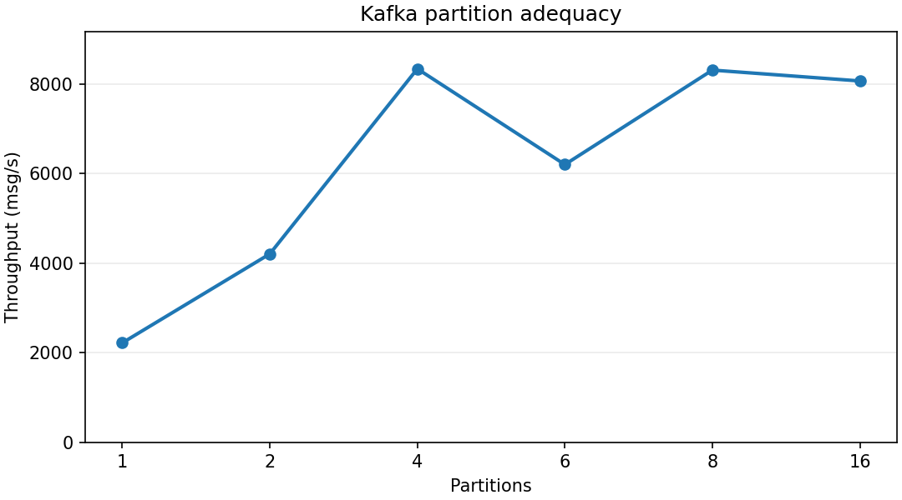
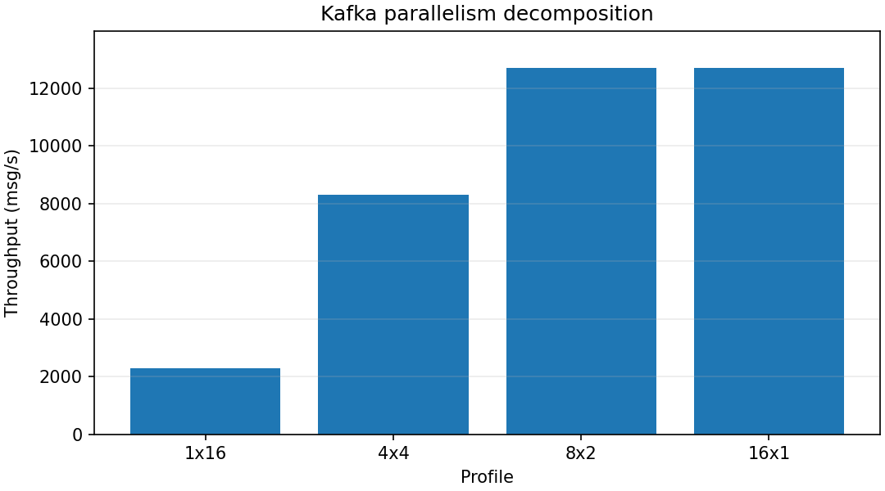
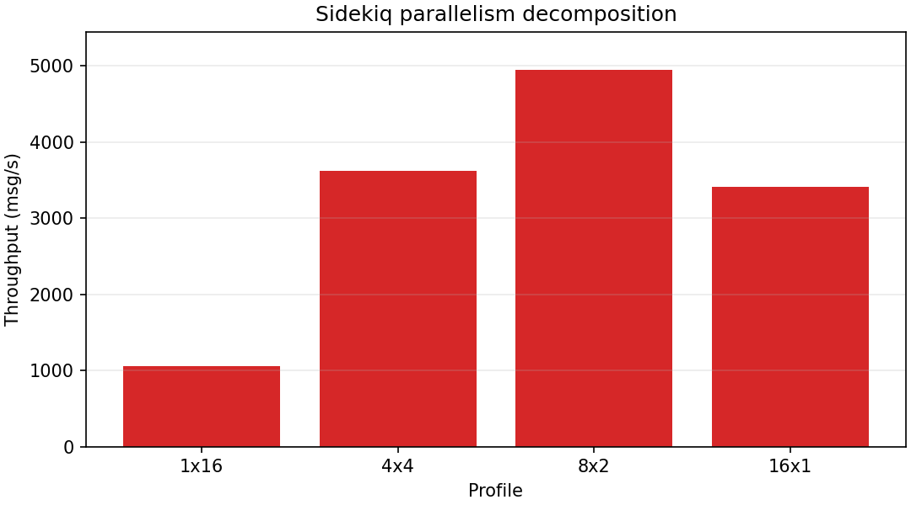
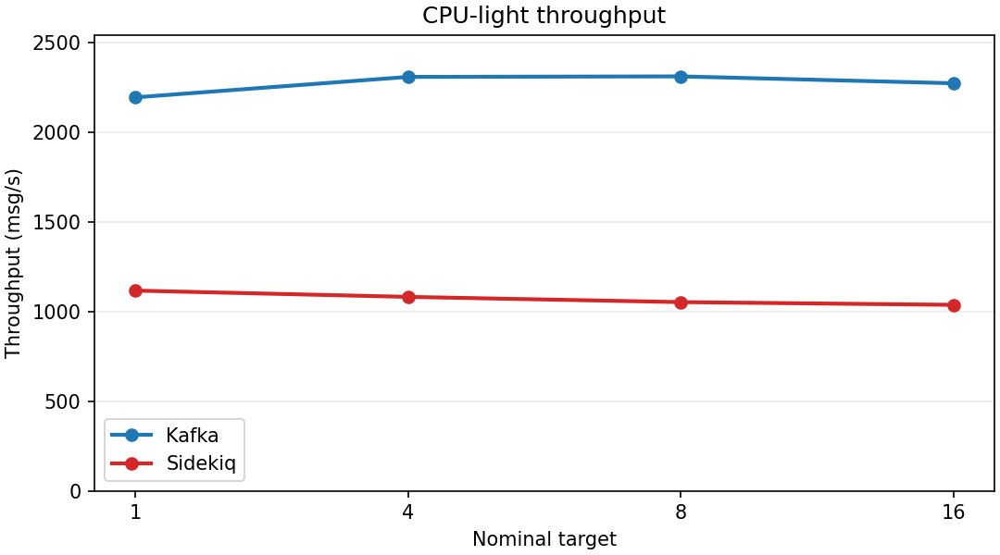
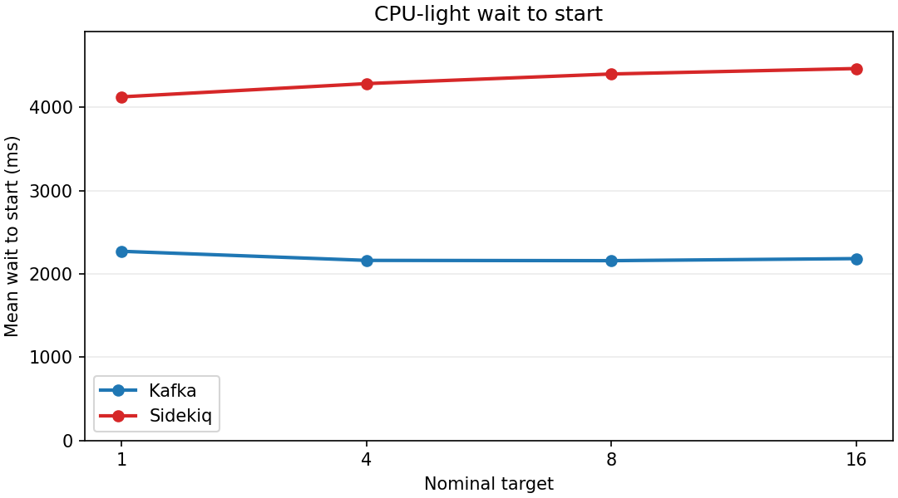
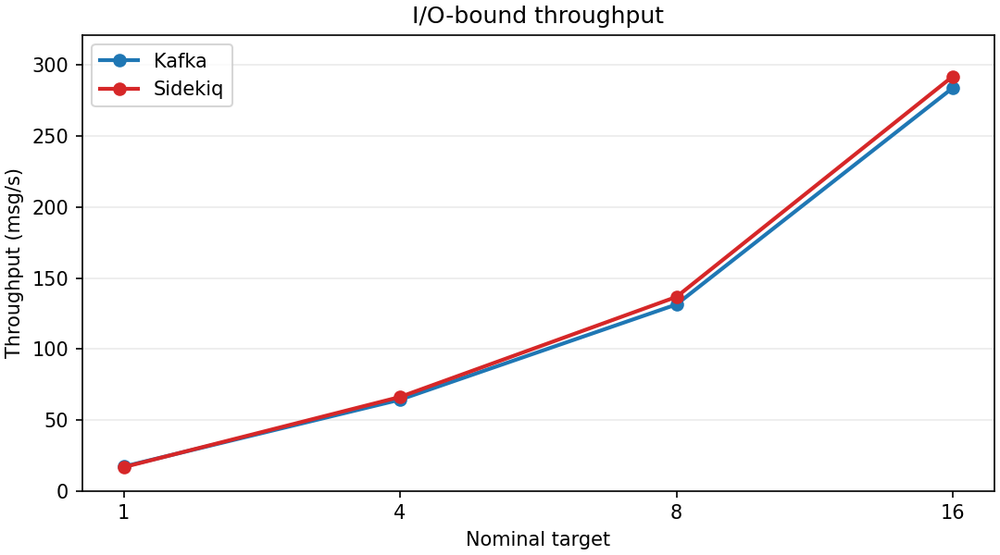
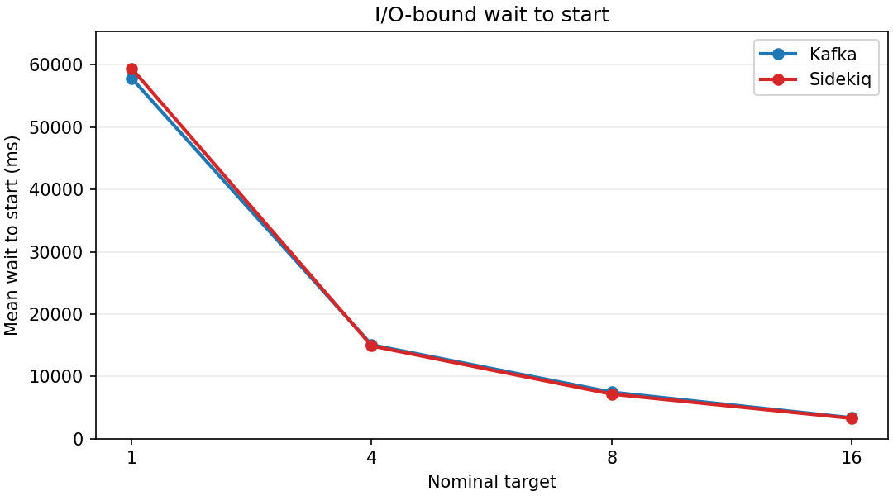
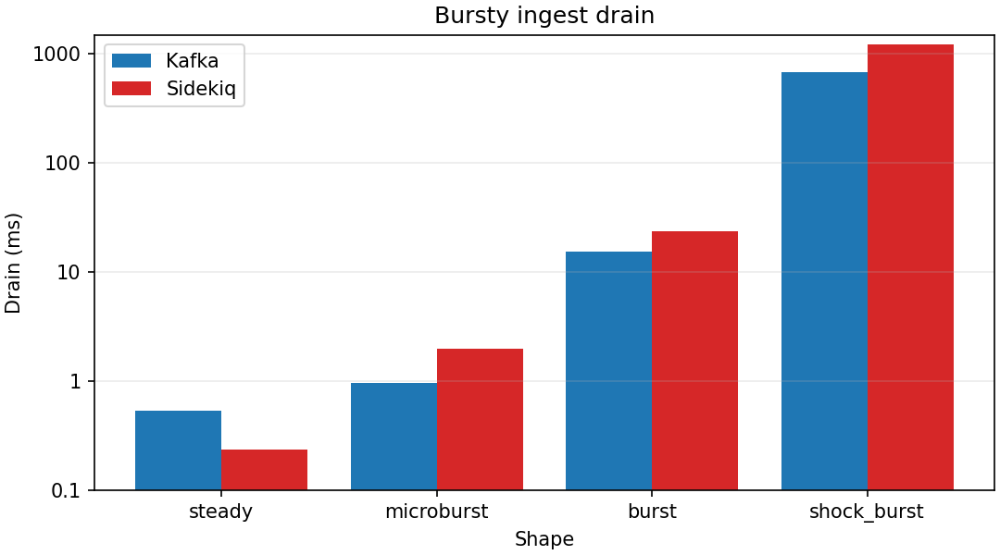
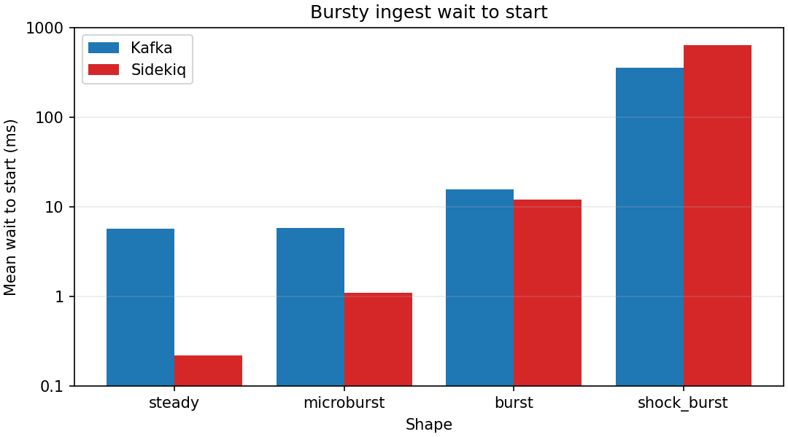
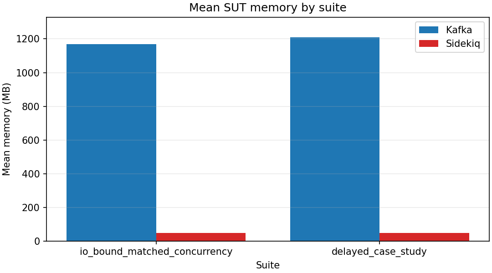

# Kafka vs Sidekiq Benchmark Report

This report summarizes validated stored results from `results/final/`.

Kafka runs as single-node KRaft with replication factor `1`.
Sidekiq uses `retry: false`.
Reliability, failure recovery, retries, fan-out, and fault injection are out of scope.

## Suites

- `kafka_partition_adequacy`
- `parallelism_decomposition`
- `cpu_light_matched_concurrency`
- `io_bound_matched_concurrency`
- `bursty_ingest_shape`
- `delayed_case_study`

## Calibration

- 2026-03-22T18:29:45.183089+00:00: theoretical ceiling 400.00 rps with 20 workers at 50 ms

Kafka comparative runs use 16 partitions and up to 16 consumer instances. Adequacy sweep throughput by partition: 1 -> 2222.65, 2 -> 4209.67, 4 -> 8343.90, 6 -> 6205.38, 8 -> 8315.15, 16 -> 8072.51 msg/s. The 95% plateau is 4, 8, 16, and the comparative runs stay on it.

## `kafka_partition_adequacy`

Partition sweep used to document the Kafka operating point for comparative suites. Kafka stays fixed at 4 replicas × 1 consumer instance per container while partitions vary.

### Kafka partition adequacy

### Kafka throughput by partition

| Partitions | Kafka |
|---|---:|
| `1` | 2222.65 +/- 40.59 |
| `2` | 4209.67 +/- 26.09 |
| `4` | 8343.90 +/- 136.38 |
| `6` | 6205.38 +/- 112.46 |
| `8` | 8315.15 +/- 117.80 |
| `16` | 8072.51 +/- 230.24 |

## `parallelism_decomposition`

Hold nominal concurrency at 16 and vary replica × per-container layout. For Kafka, the profile means consumer replicas × consumer instances per container. For Sidekiq, the profile means worker replicas × threads per worker.

### Kafka parallelism decomposition

### Sidekiq parallelism decomposition

### Throughput

| Profile | Kafka | Sidekiq |
|---|---:|---:|
| `1x16` | 2290.20 +/- 11.47 | 1059.55 +/- 5.29 |
| `4x4` | 8312.87 +/- 44.47 | 3624.15 +/- 101.07 |
| `8x2` | 12696.12 +/- 209.50 | 4950.83 +/- 303.06 |
| `16x1` | 12712.91 +/- 500.19 | 3409.48 +/- 31.20 |

## `cpu_light_matched_concurrency`

Single-container matched nominal concurrency with minimal per-message work (1000 SHA-256 iterations). Kafka interprets the target as configured consumer instances. Sidekiq interprets it as processor slots.

### CPU-light throughput

### CPU-light wait to start

### CPU-light throughput

| Nominal target | Kafka | Sidekiq |
|---|---:|---:|
| `1` | 2194.58 +/- 69.38 | 1117.25 +/- 14.56 |
| `4` | 2308.56 +/- 12.50 | 1082.26 +/- 10.00 |
| `8` | 2311.40 +/- 12.15 | 1053.14 +/- 10.92 |
| `16` | 2273.07 +/- 25.26 | 1037.90 +/- 12.27 |

## `io_bound_matched_concurrency`

Matched nominal concurrency with a 50 ms stub HTTP dependency. Compare throughput and wait-to-start against the calibrated stub ceiling. Kafka interprets the target as configured consumer instances. Sidekiq interprets it as processor slots.

### I/O-bound calibrated stub ceiling

Latest matching stub calibration reports a theoretical ceiling of 400.00 rps with 20 workers at 50 ms.

| Nominal target | Kafka % of ceiling | Sidekiq % of ceiling |
|---|---:|---:|
| `1` | 4.3% | 4.2% |
| `4` | 16.1% | 16.6% |
| `8` | 32.8% | 34.2% |
| `16` | 71.0% | 73.0% |

### I/O-bound throughput

### I/O-bound wait to start

### I/O-bound throughput

| Nominal target | Kafka | Sidekiq |
|---|---:|---:|
| `1` | 17.23 +/- 0.15 | 16.83 +/- 0.14 |
| `4` | 64.34 +/- 0.38 | 66.26 +/- 0.41 |
| `8` | 131.37 +/- 2.31 | 136.70 +/- 1.38 |
| `16` | 283.87 +/- 3.52 | 291.97 +/- 2.68 |

### I/O-bound wait to start

| Nominal target | Kafka | Sidekiq |
|---|---:|---:|
| `1` | 57872.42 +/- 308.08 | 59458.66 +/- 523.35 |
| `4` | 15073.68 +/- 11.95 | 14907.74 +/- 93.06 |
| `8` | 7476.79 +/- 25.40 | 7174.99 +/- 100.28 |
| `16` | 3376.66 +/- 19.29 | 3296.38 +/- 34.05 |

## `bursty_ingest_shape`

Producer-shape comparison for burst absorption. Total message count and consumer concurrency stay fixed; the measured outputs are drain time and wait-to-start.

### Bursty ingest drain

### Bursty ingest wait to start

### Bursty ingest drain time

| Shape | Kafka | Sidekiq |
|---|---:|---:|
| `steady` | 0.53 +/- 0.25 ms | 0.23 +/- 0.06 ms |
| `microburst` | 0.97 +/- 0.12 ms | 2.00 +/- 0.35 ms |
| `burst` | 15.30 +/- 0.40 ms | 23.53 +/- 0.38 ms |
| `shock_burst` | 689.57 +/- 1.08 ms | 1235.90 +/- 5.44 ms |

### Bursty ingest wait to start

| Shape | Kafka | Sidekiq |
|---|---:|---:|
| `steady` | 5.63 +/- 0.02 | 0.22 +/- 0.00 |
| `microburst` | 5.80 +/- 0.04 | 1.10 +/- 0.01 |
| `burst` | 15.56 +/- 0.15 | 11.93 +/- 0.08 |
| `shock_burst` | 357.04 +/- 1.42 | 630.31 +/- 1.97 |

## `delayed_case_study`

Delayed-execution case study. Kafka waits in the consumer until target time. Sidekiq uses native scheduled jobs. Target times are distributed across the 30 s delay window. Main outputs are lateness and jitter.

### Delayed start lateness

| System | Mean lateness ms | P95 ms | P99 ms | Jitter ms | On-time <= 500 ms % |
|---|---:|---:|---:|---:|---:|
| `kafka` | 2162.01 | 10626.16 | 13094.36 | 3669.52 | 65.90 |
| `sidekiq` | 4219.26 | 8359.31 | 9433.87 | 2444.60 | 6.80 |

## Appendix

### Resource Usage

Resource usage is coarse SUT-only context.
Mean SUT memory is charted here because the gap is large and stable; CPU is noisier and harder to interpret from coarse Docker stats.
Kafka totals include `kafka_broker` and `kafka_consumer`. Sidekiq totals include `redis_broker` and `sidekiq_worker`.
Only paired workflow runs with at least 3 samples and complete role coverage are included.

### Mean SUT memory by suite

_Supporting context only._

#### `parallelism_decomposition`

_Resource usage is omitted from interpretation for `parallelism_decomposition` because paired SUT samples were insufficient or incomplete._
#### `cpu_light_matched_concurrency`

_Resource usage is omitted from interpretation for `cpu_light_matched_concurrency` because paired SUT samples were insufficient or incomplete._
#### `io_bound_matched_concurrency`

| System | Included runs | Mean CPU % | Mean memory MB |
|---|---:|---:|---:|
| `kafka` | 10 | 24.52 | 1168.06 |
| `sidekiq` | 10 | 19.59 | 48.15 |
#### `bursty_ingest_shape`

_Resource usage is omitted from interpretation for `bursty_ingest_shape` because paired SUT samples were insufficient or incomplete._
#### `delayed_case_study`

| System | Included runs | Mean CPU % | Mean memory MB |
|---|---:|---:|---:|
| `kafka` | 3 | 9.24 | 1208.06 |
| `sidekiq` | 3 | 3.36 | 47.88 |

## Warnings

- Partition-cap warning for kafka_partition_adequacy/partitions=1: Kafka configures 4 consumer instances but partitions cap assignment parallelism at 1
- Partition-cap warning for kafka_partition_adequacy/partitions=2: Kafka configures 4 consumer instances but partitions cap assignment parallelism at 2
